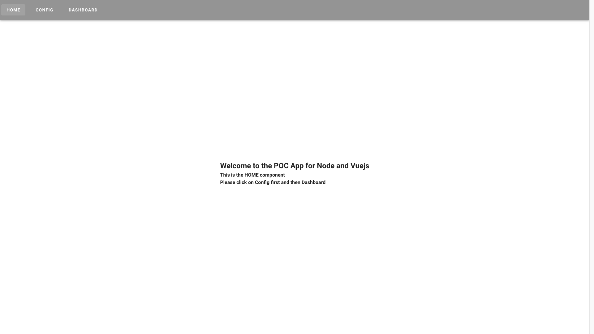
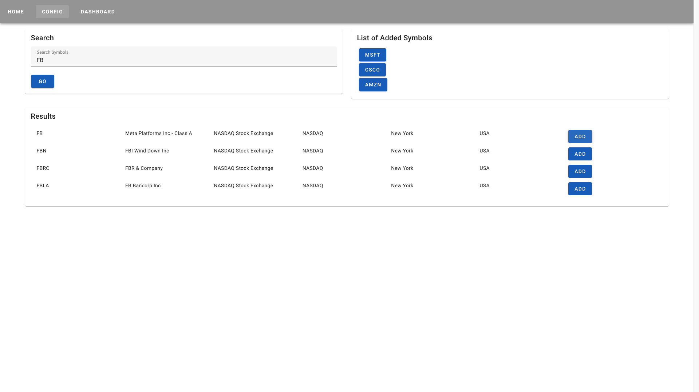
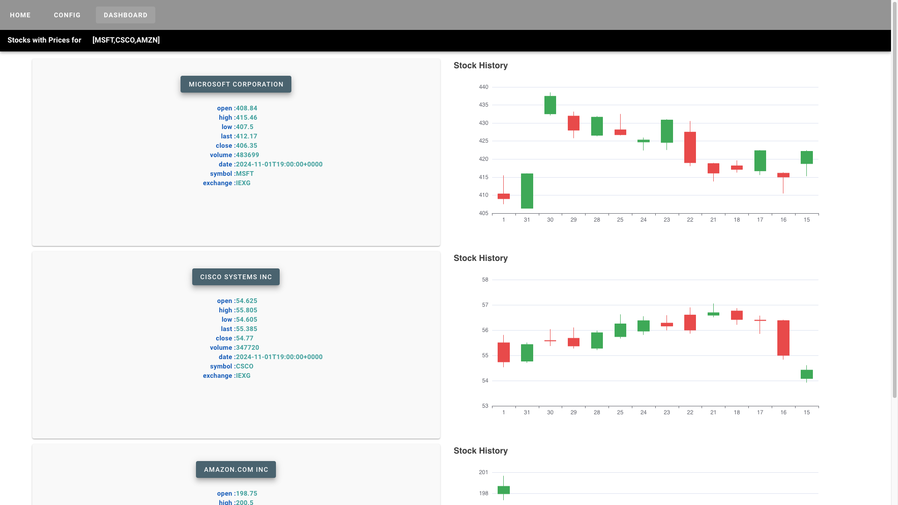

# stocksapp
This repository contains Stock Market Analysis App built using Nodejs, Redis, Vuejs, Echarts and MarketStack APIs (https://marketstack.com/)

There is one backend app named app1 and one client app client1.

Steps:
1. You will need to get your own key and set it in app1/.env file. Example - TOKEN=YOUR-KEY
2. Install Redis on your local system
3. Run pnpm install in app1 and run it through pnpm start
4. Run pnpm install in client1 and run it through pnpm run dev 

HOME Component
# 

Configuration Component
# 

Charts Component (using google charts here)
# 

MarketStack APIs used - 

Symbol Search
https://api.marketstack.com/v1/tickers?search=MSFT&exchange=XNAS&access_key=YOUR-KEY

Historical Search
http://api.marketstack.com/v1/eod?symbols=CSCO&access_key=YOUR-KEY
http://api.marketstack.com/v1/eod?date_from=2024-10-14&date_to=2024-11-03&symbols=AMZN,MSFT&access_key=YOUR-KEY

Realtime/Intraday/Price Data
http://api.marketstack.com/v1/intraday/latest?symbols=AMZN,MSFT&exchange=XNAS&access_key=YOUR-KEY

Localhost APIs

Config
http://localhost:3000/api/config

Search
http://localhost:3000/api/search?symbol=AMZN

Historical
http://localhost:3000/api/stocks?symbol=MSFT

Current Price
curl --header "Content-Type: application/json" \
  --request POST \
  --data '{"access_key":"YOUR-KEY","symbols":"MSFT,AMZN"}' \
  http://localhost:3000/api/stocks/price
